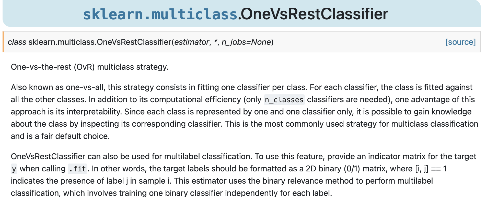

exclude: true


```{r, include = FALSE}
if (!require("knitr")) install.packages("knitr")

# Define Colors
green          = "#8bb174"
grey_light     = "grey70"
grey_mid       = "grey50"
grey_dark      = "grey20"
purple         = "#6A5ACD"
red_pink       = "#e64173"
turquoise      = "#20B2AA"
orange         = "#FFA500"
red            = "#fb6107"
blue           = "#3b3b9a"
brown          = "#9b684d"
black          = "#000000"
magenta_red    = "#9b4d80"
magenta_green  = "#4d9b68"
red_green      = "#9b4d59"
blue_green     = "#4d599b"
magenta_yellow = "#9b8f4d"


# Knitr Options Setting
opts_chunk$set(
  comment = "#>",
  fig.align = "center",
  fig.height = 7,
  fig.width = 10.5,
  warning = F,
  message = F
)
opts_chunk$set(dev = "svg")
options(device = function(file, width, height) {
  svg(tempfile(), width = width, height = height)
})
options(knitr.table.format = "html")

# pagedown::chrome_print("file:///Users/yenchiehliao/Dropbox/slide-template/slides.html#1", verbose = FALSE)
```

---
layout: true
# Comments

---
name:

--

- The Findings:

--

  1. The paper systematically examines violent contents expressed in Twitter by utilizing machine learning methods to find the rhetoric pasterns. 

--

  2. The finding point to the evidence that the violent tweets closely occured the preceding the Capital Riot.

--

- Contribution: 

--

 1. automated method to discover the pasterns in violent rhetoric. 

--

 2. hard work: labeling the data and then training the classifiers (Kim's model/classifier)

--

 3. new approach to study political conflict.
 
---
layout: true
# A Few Concerns
---

--

- Performance (and Performance Measures)

--

```{r echo = F, out.width = "50%"}

```

 1. Confusion Matrix? (Precision: TP / TP+FP ;  Recall: TP / TP+FN)

--

 2. trade-off between a precision/recall: AUC, Precision versus recall

--

 3. ROC curves?

---
layout: true
# The Classifiers
---

- Imbalanced training class (reference: https://www.analyticsvidhya.com/blog/2020/07/10-techniques-to-deal-with-class-imbalance-in-machine-learning/)
 
```{r echo = F, out.width = "40%"}

```
--

- use `imblearn` with `oversampling method` or `undersample method`  to generate new samples to balance the classes before cv.  (solution reference: https://kiwidamien.github.io/how-to-do-cross-validation-when-upsampling-data.html)

--

- feature scaling: min-max or standardization ideally.

--

- bruteforcefully generate more violent contents based on the domain knowledge
 
---
layout: true
# Difficulties in Training Twitter's Data
---

--

- Noisy words in twitter data and the tweet length is limited
 
 1. countvectorizing tweets might generate not much sense feature for the classifiers (symbols, emoji, emoticon, unformal expressions). 

--

 2. Suggestion one: `CountVectorizer() ` with `tokenizeRawTweetText()` from twokenize.py (https://github.com/myleott/ark-twokenize-py)
 
```{r echo = F, out.width = "35%"}

```


---

--

-  Suggestion two:
  
 1. Use `TweeboParser` from **Tweet NLP** (https://www.cs.cmu.edu/~ark/TweetNLP/#parser_paper) at Carnegie Mellon:
 part-of-speech tagger for tweets, its training data of manually labeled POS annotated tweets, a web-based annotation tool, and hierarchical word clusters from unlabeled tweets.

--

 2. Trai selective feature like active verb, specific tags and emoji like `:o` `:/`` >.<` `XD` `-__-`
 
```{r echo = F, out.width = "50%"}

```


---
layout: true
# Performance Measures (Suggested):
---

--

- Saving holdout from tainset for validation

  + hold out part of the training set to evaluate several candidate models and select the best one.
  
  + if good number of the validation set can be extract from training. 

--

- One-vs-the-one strategy (aka One-vs-the-rest, OVR).

```{r echo = F, out.width = "50%"}

```
 


---
layout: true
# Closing Mark
---

<br />


- method: very promising and highly innovated 

--

- thoughtful research design 

--

- policy implication

 
 